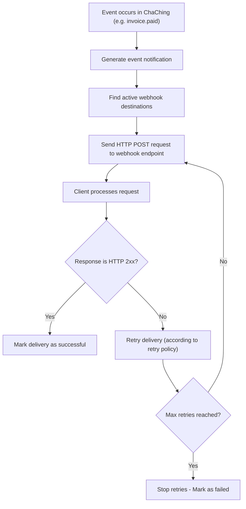

# Webhooks

ChaChing Webhooks allow your system to receive **real-time notifications** when events occur in your ChaChing account (e.g., customer updates, payments, subscriptions).

Webhooks are designed for clients using the **public API**, which allows them to react to system changes without polling.

---

# How Webhooks Work



1. An event occurs in ChaChing (e.g., customer details updated). For details related to the event types, refer to the section [Event Types](https://www.notion.so/Webhook-API-326dc7fc0a9280d087a1fe916d21c46c?pvs=21).
2. ChaChing generates an event notification.
3. ChaChing identifies all **active webhook endpoints** configured for the account.
4. ChaChing sends the event with its payload as an **HTTP POST request** to each webhook endpoint.
    Note: For payload details, refer to the **Event Structure** section.
5. Your system receives and processes the event.
6. Your endpoint must return an HTTP `2xx` response:
    - If a `2xx` response is returned, the delivery is marked as **successful**
    - If a non-`2xx` response or no response is returned, the delivery is considered **failed**

---

# Retry Behavior

ChaChing automatically retries failed webhook deliveries.

Retries are triggered when:

- Network failure
- Timeout
- Non-`2xx` HTTP response

**Retry Flow:**

- If delivery fails, webhook is retried
- If **max retries NOT reached,** retry continues
- If **max retries reached,** marked as **failed**

**Retry Policy:**

- Attempts: **5 times** *(to be confirmed)*
- Delay: **5 seconds** *(to be confirmed)*

> ⚠️ Webhooks may be delivered multiple times. Ensure your system handles duplicates (use event `id`).
> 

---

# Key Concepts

### Webhooks are account-level

- Webhooks are configured **per account**
- Each account has its own webhook endpoints
- Events generated in one account are **not shared** with other accounts

---

### Multiple webhook endpoints

- You can create **multiple webhook endpoints**
- Events are sent to **all active endpoints within the account**

---

# Webhook Configuration (UI)

To manage endpoints go to:

1. In ChaChing, go to Settings → Developer settings.
2. In the Developer Settings, select Webhooks tab to:
    - Create webhook endpoints
    - View all endpoints
    - Enable / disable endpoints
    - Edit/Delete endpoints

> Only users with appropriate permissions (e.g. Developer/Admin) can manage webhooks. For the user roles details, refer to the section Manage → Users in the left panel of Chaching application.
> 


---
    
# Creating a Webhook

To create a webhook:

1. Open **Developer Settings → Webhooks.**
2. Click **Create webhook.**



3. Enter endpoint URL and then select **Create endpoint**.

After creation:

- Webhook becomes **active**
- Events start being delivered immediately

---

# Event Types

ChaChing generates webhook events for key system entities. Each event represents a specific change or action performed in the system.

> Note: When you create a webhook you receive **ALL events without the ability to subscribe to a specific event type**.
> 

---

## Customer Events

- `customer.created` — A new customer is created
- `customer.updated` — An existing customer is updated
- `customer.deleted` — A customer is deleted

---

## Payment Method Events

- `payment_method.created` — A payment method is created
- `payment_method.attached` — A payment method is attached to a customer
- `payment_method.detached` — A payment method is detached from a customer

---

## Invoice Events

- `invoice.created` — A new invoice is created
- `invoice.updated` — An invoice is updated
- `invoice.deleted` — An invoice is deleted
- `invoice.finalized` — An invoice is finalized and ready for payment
- `invoice.sent` — An invoice is sent to the customer
- `invoice.payment_succeeded` — Invoice payment completed successfully
- `invoice.payment_failed` — Invoice payment failed

---

## Subscription Events

- `subscription.created` — A subscription is created
- `subscription.updated` — A subscription is updated
- `subscription.canceled` — A subscription is canceled
- `subscription.paused` — A subscription is paused
- `subscription.resumed` — A paused subscription is resumed

---

## Product Events

- `product.created` — A product is created
- `product.updated` — A product is updated
- `product.deleted` — A product is deleted

---

## Price Events

- `price.created` — A price is created
- `price.updated` — A price is updated
- `price.deleted` — A price is deleted

---

## Tax Events

- `tax.created` — A tax configuration is created
- `tax.updated` — A tax configuration is updated

---

## Summary

ChaChing currently supports **27 webhook event types** across such entities as:

- Customers
- Payment Methods
- Invoices
- Subscriptions
- Products
- Prices
- Taxes

---

# Event Status

Webhook delivery has the following internal states:

- `pending` → waiting to be sent
- `retry` → retry in progress
- `success` → delivered successfully
- `failure` → all retries exhausted

---

# Event Structure

All ChaChing webhook events share a **common envelope structure**, with the actual entity data contained inside the `data` field.

---

## Common Event Envelope

Every webhook sent by ChaChing follows this structure:

```json
{
  "id": "evt_123456",
  "event": "customer.updated", // specific to the event type 
  "createdAt": "2026-03-13T11:15:00Z",
  "data": {
    // Entity-specific payload
  }
}
```

---

## Fields Description

- `id` — Unique event identifier (used for deduplication)
- `event` — Event type (see Event Types section)
- `createdAt` — Timestamp when the event was generated
- `data` — **Entity payload** (varies depending on event type)

> ❗ Important: `data` already contains the object. There is **no `data.object` nesting**.
> 

---

## Customer Events Payload

Events:

- `customer.created`
- `customer.updated`
- `customer.deleted`

---

### Schema

```json
{
  "id": "cus_XXXXXXXX",
  "object": "customer",
  "name": "string",
  "email": "string",
  "description": "string | null",
  "phone": "string | null",
  "created": 1672531200,
  "currency": "string",
  "address": [
    {
      "city": "string",
      "country": "string",
      "line1": "string",
      "line2": "string",
      "postal_code": "string",
      "state": "string"
    }
  ],
  "shipping": {
    "name": "string",
    "phone": "string | null",
    "address": {
      "city": "string",
      "country": "string",
      "line1": "string",
      "line2": "string",
      "postal_code": "string",
      "state": "string"
    }
  }
}
```

---

### Example

```json
{
  "id": "evt_111",
  "event": "customer.created",
  "createdAt": "2026-03-13T11:15:00Z",
  "data": {
    "id": "cus_NffrFeUfNV2Hib",
    "object": "customer",
    "name": "John Doe",
    "email": "john.doe@example.com",
    "description": "My First Test Customer",
    "phone": null,
    "created": 1680893993,
    "currency": "USD",
    "address": [
      {
        "city": "San Francisco",
        "country": "US",
        "line1": "123 Market St",
        "line2": "Apt 4B",
        "postal_code": "94103",
        "state": "CA"
      }
    ],
    "shipping": {
      "name": "John Doe",
      "phone": "+1 (555) 123-4567",
      "address": {
        "city": "San Francisco",
        "country": "US",
        "line1": "123 Market St",
        "line2": "Apt 4B",
        "postal_code": "94103",
        "state": "CA"
      }
    }
  }
}
```

---

### Notes

- The `address` field is an **array of address objects**
- The `shipping.address` is a **single object** (not an array)
- The `phone` and `description` fields may be `null`
- Timestamps are in Unix format (seconds)

---

## Payment Method Events Payload

Events:

- `payment_method.created`
- `payment_method.attached`
- `payment_method.detached`

### Schema

```json
{
  "id": "pm_XXXXXXXX",
  "object": "payment_method",
  "allow_redisplay": "string",
  "billing_details": {
    "address": {
      "city": "string | null",
      "country": "string | null",
      "line1": "string | null",
      "line2": "string | null",
      "postal_code": "string | null",
      "state": "string | null"
    },
    "email": "string | null",
    "name": "string | null",
    "phone": "string | null"
  },
  "created": 1672531200,
  "customer": "cus_XXXXXXXX | null",
  "livemode": false,
  "metadata": {},
  "type": "string",
  "us_bank_account": {
    "account_holder_type": "individual | company",
    "account_type": "checking | savings",
    "bank_name": "string",
    "financial_connections_account": "string | null",
    "fingerprint": "string",
    "last4": "string",
    "networks": {
      "preferred": "string",
      "supported": ["string"]
    },
    "routing_number": "string",
    "status_details": {}
  }
}
```

### Example

```json
{
  "id": "evt_123",
  "event": "payment_method.created",
  "createdAt": "2026-03-13T11:15:00Z",
  "data": {
    "id": "pm_1Q0PsIJvEtkwdCNYMSaVuRz6",
    "object": "payment_method",
    "allow_redisplay": "unspecified",
    "billing_details": {
      "address": {
        "city": null,
        "country": null,
        "line1": null,
        "line2": null,
        "postal_code": null,
        "state": null
      },
      "email": null,
      "name": "John Doe",
      "phone": null
    },
    "created": 1726673582,
    "customer": null,
    "livemode": false,
    "metadata": {},
    "type": "us_bank_account",
    "us_bank_account": {
      "account_holder_type": "individual",
      "account_type": "checking",
      "bank_name": "STRIPE TEST BANK",
      "financial_connections_account": null,
      "fingerprint": "LstWJFsCK7P349Bg",
      "last4": "6789",
      "networks": {
        "preferred": "ach",
        "supported": [
          "ach"
        ]
      },
      "routing_number": "110000000",
      "status_details": {}
    }
  }
}
```

### Notes

- The `type` field defines the structure of the payment method (e.g., `card`, `us_bank_account`)
- The corresponding object (e.g., `us_bank_account`) is included based on the `type`
- Some fields may be `null` depending on the payment method and available data

---

## Invoice Events Payload

Events:

- `invoice.created`
- `invoice.updated`
- `invoice.deleted`
- `invoice.finalized`
- `invoice.sent`
- `invoice.payment_succeeded`
- `invoice.payment_failed`

### Schema

```json
{
  "id": "string",
  "object": "invoice",
  "account_country": "string",
  "account_name": "string",
  "amount_due": 0,
  "amount_paid": 0,
  "amount_remaining": 0,
  "attempt_count": 0,
  "attempted": true,
  "billing_reason": "string",
  "collection_method": "string",
  "created": 1672531200,
  "currency": "string",
  "customer": "cus_XXXXXXXX",
  "customer_address": {
    "city": "string",
    "country": "string",
    "line1": "string",
    "line2": "string",
    "postal_code": "string",
    "state": "string"
  },
  "customer_email": "string",
  "customer_name": "string",
  "customer_phone": "string",
  "lines": [],
  "number": "string",
  "paid": true,
  "period_end": 1672531200,
  "period_start": 1672531200,
  "status": "draft | open | paid | void",
  "status_transitions": {
    "finalized_at": 1672531200,
    "paid_at": 1672531200,
    "voided_at": 1672531200
  },
  "subscription": "sub_XXXXXXXX",
  "subtotal": 0,
  "subtotal_excluding_tax": 0,
  "tax": 0,
  "total": 0,
  "total_excluding_tax": 0,
  "total_taxes": {
    "amount": 0,
    "tax_behavior": "inclusive | exclusive",
    "tax_rate": "txr_XXXXXXXX",
    "taxable_amount": 0
  }
}
```

### Example

```json
{
  "id": "evt_456",
  "event": "invoice.payment_succeeded",
  "createdAt": "2026-03-13T11:15:00Z",
  "data": {
    "id": "a80baa67-1341-4184-b712-b6f9b85b5a2b",
    "object": "invoice",
    "account_country": "US",
    "account_name": "Acme Corp",
    "amount_due": 1500,
    "amount_paid": 500,
    "amount_remaining": 1000,
    "attempt_count": 1,
    "attempted": true,
    "billing_reason": "subscription",
    "collection_method": "charge_automatically",
    "created": 1680645568,
    "currency": "USD",
    "customer": "cus_383fda0065594749023e8c8d",
    "customer_address": {
      "city": "San Francisco",
      "country": "US",
      "line1": "123 Market St",
      "line2": "Apt 4B",
      "postal_code": "94103",
      "state": "CA"
    },
    "customer_email": "john.doe@example.com",
    "customer_name": "John Doe",
    "customer_phone": "+1234567890",
    "lines": [],
    "number": "INV-1001",
    "paid": true,
    "period_end": 1680645568,
    "period_start": 1680645568,
    "status": "paid",
    "status_transitions": {
      "finalized_at": 1680645568,
      "paid_at": 1680645568,
      "voided_at": 1680645568
    },
    "subscription": "sub_Wm45f5PGQvv67azFeH1z7PO3",
    "subtotal": 1500,
    "subtotal_excluding_tax": 1500,
    "tax": 150,
    "total": 1650,
    "total_excluding_tax": 1500,
    "total_taxes": {
      "amount": 150,
      "tax_behavior": "exclusive",
      "tax_rate": "txr_1S2tlWDZYOQH9uHkltYEi1ap",
      "taxable_amount": 1500
    }
  }
}
```

### Notes

- The `status` field reflects the current lifecycle state of the invoice
- `status_transitions` shows timestamps for key lifecycle changes
- Monetary values are represented in the smallest currency unit (e.g., cents)
- The `lines` field contains invoice line items (structure may vary)
- Some fields may be `null` depending on invoice state and configuration

---

## Subscription Events Payload

Events:

- `subscription.created`
- `subscription.updated`
- `subscription.canceled`
- `subscription.paused`
- `subscription.resumed`

---

### Schema

```json
{
  "id": "sub_XXXXXXXX",
  "object": "subscription",
  "billing_cycle_anchor": 1672531200,
  "cancel_at": 1672531200,
  "cancel_at_period_end": false,
  "canceled_at": 1672531200,
  "collection_method": "string",
  "created": 1672531200,
  "currency": "string",
  "customer": "cus_XXXXXXXX",
  "ended_at": 1672531200,
  "items": {
    "object": "list",
    "data": [
      []
    ],
    "total_count": 0
  },
  "latest_invoice": "string",
  "start_date": 1672531200,
  "status": "active | canceled | paused",
  "trial_end": 1672531200,
  "trial_start": 1672531200
}
```

---

### Example

```json
{
  "id": "evt_789",
  "event": "subscription.created",
  "createdAt": "2026-03-13T11:15:00Z",
  "data": {
    "id": "sub_2FdhgypnsJQn9mZlY5qGaElL",
    "object": "subscription",
    "billing_cycle_anchor": 1679609767,
    "cancel_at": null,
    "cancel_at_period_end": false,
    "canceled_at": null,
    "collection_method": "charge_automatically",
    "created": 1679609767,
    "currency": "USD",
    "customer": "cus_739c07713fd4b68565a969cd",
    "ended_at": null,
    "items": {
      "object": "list",
      "data": [
        []
      ],
      "total_count": 1
    },
    "latest_invoice": "58d0f1c9-ca00-4998-8e89-d74a290b4df6",
    "start_date": 1679609767,
    "status": "active",
    "trial_end": null,
    "trial_start": null
  }
}
```

---

### Notes

- The `status` field represents the current subscription state (e.g., `active`, `canceled`, `paused`)
- Fields like `cancel_at`, `canceled_at`, and `ended_at` may be `null` depending on lifecycle state
- `items.data` contains subscription items (structure depends on pricing configuration)
- `latest_invoice` links the most recent invoice associated with the subscription
- Timestamps are in Unix format (seconds)

---

## Product Events Payload

Events:

- `product.created`
- `product.updated`
- `product.deleted`

### Schema

```json
{
  "id": "prod_XXXXXXXX",
  "object": "product",
  "active": true,
  "created": 1672531200,
  "default_price": "price_XXXXXXXX",
  "description": "string | null",
  "name": "string",
  "tax_code": "string",
  "updated": 1672531200
}
```

### Example

```json
{
  "id": "evt_321",
  "event": "product.updated",
  "createdAt": "2026-03-13T11:15:00Z",
  "data": {
    "id": "prod_xT4LfvxLMQb4s9uFNIbXf9pm",
    "object": "product",
    "active": true,
    "created": 1760018761,
    "default_price": "price_1SGKTmDZYOQH9uHk1vaSxPKa",
    "description": null,
    "name": "Gold Plan",
    "tax_code": "txcd_10000000",
    "updated": 1753181495
  }
}
```

### Notes

- The `default_price` field references the default price associated with the product
- The `description` field may be `null` if not provided
- The `active` field indicates whether the product is available for use
- Timestamps are in Unix format (seconds)

---

## Price Events Payload

Events:

- `price.created`
- `price.updated`
- `price.deleted`

### Schema

```json
{
  "id": "price_XXXXXXXX",
  "object": "price",
  "active": true,
  "created": 1672531200,
  "currency": "string",
  "description": "string | null",
  "product": "prod_XXXXXXXX | null",
  "recurring": {
    "interval": "day | week | month | year",
    "interval_count": 0
  },
  "tax_behavior": "inclusive | exclusive",
  "type": "one_time | recurring",
  "unit_amount": 0,
  "unit_amount_decimal": "string",
  "link": "string"
}
```

### Example

```json
{
  "id": "evt_654",
  "event": "price.created",
  "createdAt": "2026-03-13T11:15:00Z",
  "data": {
    "id": "price_1SGKTmDZYOQH9uHk1vaSxPKa",
    "object": "price",
    "active": true,
    "created": 1760018761,
    "currency": "USD",
    "description": "Premium Plan - Monthly",
    "product": null,
    "recurring": {
      "interval": "month",
      "interval_count": 1
    },
    "tax_behavior": "exclusive",
    "type": "one_time",
    "unit_amount": 1000,
    "unit_amount_decimal": "1000",
    "link": "string"
  }
}
```

---

### Notes

- The `type` field defines whether the price is **one-time** or **recurring**
- The `recurring` object is relevant for subscription-based pricing
- `unit_amount` is represented in the smallest currency unit (e.g., cents)
- `product` may be `null` if not linked
- `unit_amount_decimal` provides a precise representation of the amount
- `tax_behavior` defines how taxes are applied (inclusive or exclusive)

---

## Tax Events Payload

Events:

- `tax.created`
- `tax.updated`

### Schema

```json
{
  "id": "txr_XXXXXXXX",
  "object": "tax_rate",
  "active": true,
  "country": "string",
  "created": 1672531200,
  "description": "string | null",
  "display_name": "string",
  "inclusive": true,
  "percentage": 0,
  "tax_type": "string"
}
```

### Example

```json
{
  "id": "evt_987",
  "event": "tax.created",
  "createdAt": "2026-03-13T11:15:00Z",
  "data": {
    "id": "txr_inQ4hbLZPyljDXFRCEnjtEqK",
    "object": "tax_rate",
    "active": true,
    "country": "US",
    "created": 1678833149,
    "description": "State sales tax",
    "display_name": "Sales Tax",
    "inclusive": true,
    "percentage": 7.25,
    "tax_type": "Custom"
  }
}
```

---

### Notes

- The `percentage` field represents the tax rate (e.g., `7.25` = 7.25%)
- The `inclusive` field indicates whether the tax is included in the price
- `tax_type` defines the type of tax configuration (e.g., custom)
- The `description` field may be `null` depending on configuration

---

# Important Notes

The data object is contained inside the `data` field.

- The `data` field contains the **full entity object**

---

Deleted events

- May contain limited data (e.g., only `id`)
- Should not be assumed to contain full object

---

Always rely on `event`

- Use `event` field to determine how to parse `data`

---

# Payload Behavior

- The payload reflects the **entity after change**
- Example:
    - Customer updated → full updated customer data is sent
    - Subscription created → full subscription object is sent

---

# Example Event

```json
{
  "external_id": "evt_789",
  "type": "customer.updated",
  "created_at": "2026-03-13T11:15:00Z",
  "data": {
    "id": "cus_123",
    "email": "user@example.com",
    "status": "active"
  }
}
```

---

# Webhook Delivery

- Method: `POST`
- Content-Type: `application/json`
- Sent to: configured endpoint URL in ChaChing application.

---

# Webhook Logs

ChaChing stores webhook delivery history.

Logs include:

- Event type
- Payload
- Delivery attempts
- Status (success / failed)

> Logs reflect actual data sent from the database
> 

*(Add screenshot later if UI exists)*

---

# Handling Webhooks (Client Side)

When receiving a webhook:

1. Accept HTTP POST request
2. Parse JSON payload
3. Read `type`
4. Process `data`
5. Return HTTP `200 OK`

---

# Important Notes for Integrators

**No event filtering**

You will receive **all events**

➡ You must filter by `type` in your system

---

**Payload varies per event**

`data` structure depends on event type

➡ You must handle multiple schemas

---

**Retries may cause duplicates**

➡ Use `external_id` to deduplicate events

---

**Endpoint must be stable**

➡ If your endpoint fails → events may be lost after retries

---